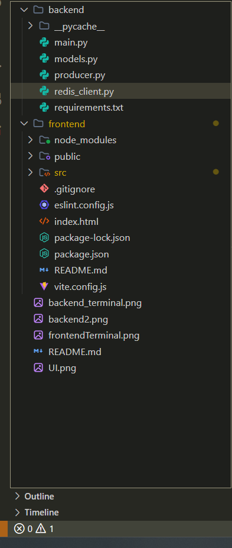
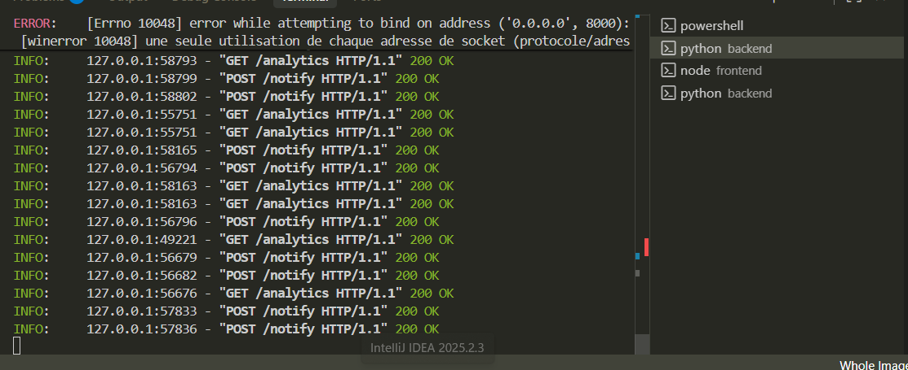
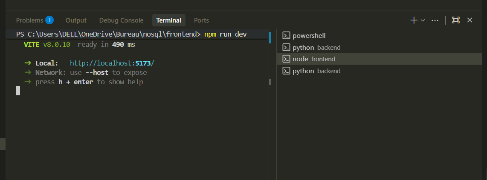
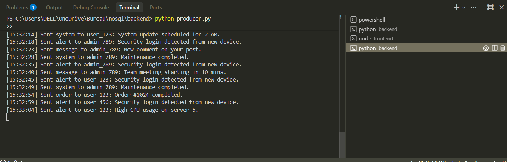
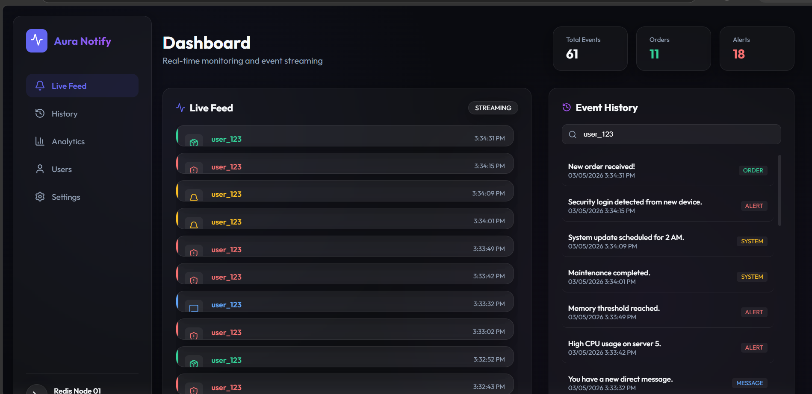

# Real-Time Notification System with Redis

This project implements a robust real-time notification system using Redis as the central messaging and storage backbone. It features a modern, premium dashboard for monitoring events in real-time.

## 🏗️ Project Structure & Architecture

The system is organized into a modular backend and a modern frontend dashboard.


*Visualizing the file organization and architecture components.*

1.  **Notification Storage**: Notifications are stored in Redis Hashes for detailed lookups and Sorted Sets for user-specific history.
2.  **Real-Time Delivery**: Leverages **Redis Pub/Sub** for instant delivery to connected clients via WebSockets.
3.  **Event Logging**: Uses **Redis Streams** to maintain an immutable log of all notification events.
4.  **Automatic Expiration**: Uses Redis **TTL** to automatically expire notification data after 24 hours.
5.  **Analytics**: Tracks event counts by type using **Redis Counters** (Atomic Increments).

## 🛠️ Tech Stack

-   **Backend**: Python, FastAPI, Redis, WebSockets.
-   **Frontend**: React, Vite, Framer Motion (Animations), Lucide (Icons).
-   **Storage**: Redis.

## 🚀 Setup Instructions

### 1. Run Redis
The easiest way is using Docker:
```bash
docker run -d --name redis-notifications -p 6379:6379 redis:latest
```

### 2. Backend Setup
Navigate to the `backend` folder, install dependencies, and start the FastAPI server:
```bash
cd backend
pip install -r requirements.txt
python main.py
```


*FastAPI server running and handling incoming notification requests.*

### 3. Frontend Setup
Navigate to the `frontend` folder and run the development server:
```bash
cd frontend
npm install
npm run dev
```


*Vite development server starting for the dashboard UI.*

### 4. Run Notification Producer
To simulate real-time notifications, run the producer script:
```bash
cd backend
python producer.py
```


*Producer script generating and sending simulated events to Redis.*

## 🖥️ Final Result: Aura Notify Dashboard


*The premium real-time dashboard featuring live feeds, historical lookups, and analytics.*

## 🌟 Features Demonstrated
- [x] **Add Notifications**: via REST API, logged to Redis Streams.
- [x] **Real-Time Subscription**: WebSockets bridged with Redis Pub/Sub.
- [x] **Notification History**: Retrieved from Redis Sorted Sets (Score = Timestamp).
- [x] **Automatic Expiration**: Keys set with EXPIRE.
- [x] **Real-Time Analytics**: Counters for total and type-specific events.
